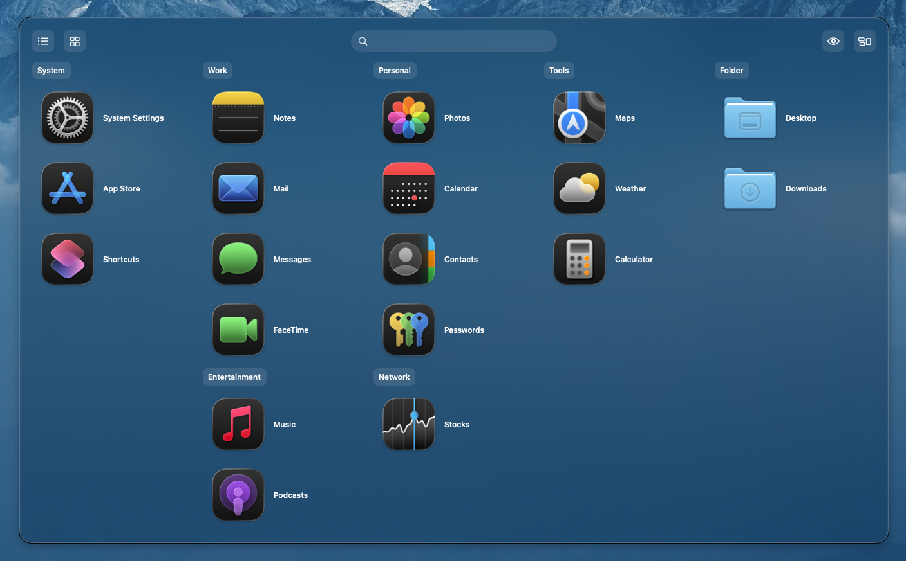
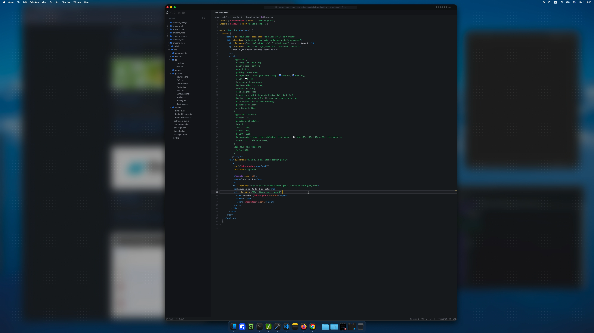
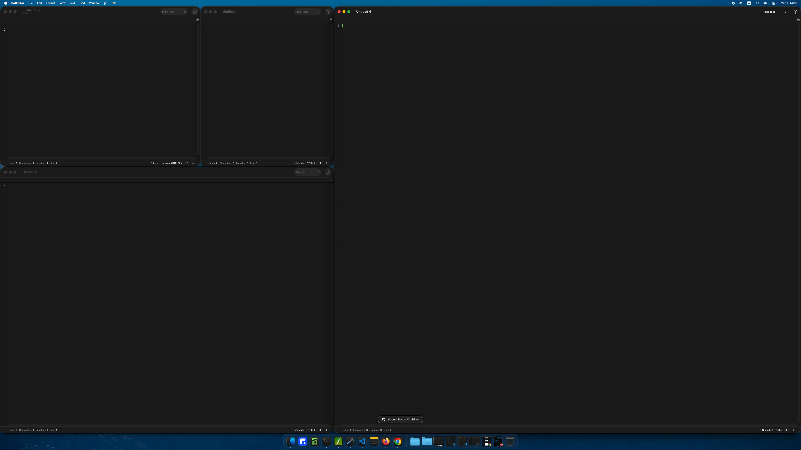

  
  <h1 align="center">Embark</h1>
  <h4 align="center">Launcher and workspace tools for macOS</h4>
  

    
    
  

## Embark

Embark is a macOS productivity app for launching apps, managing windows, and moving through workspaces with less friction. It combines a launcher, a window switcher, and workspace controls with fast keyboard and mouse shortcuts, so common actions stay close at hand instead of buried in menus.

Embark also includes focus tools for reducing distractions, magnet-style window placement helpers, and space management features for saving and restoring window layouts across desktops.

## Feature Gallery

### Launcher

### Focus

### Magnet

<video src="./docs/assets/feature_magnet.mp4" controls muted playsinline width="100%"></video>

### Space

<video src="./docs/assets/feature_space.mp4" controls muted playsinline width="100%"></video>

## Download

[https://github.com/potor-com/Embark/releases](https://github.com/potor-com/Embark/releases)

## System Requirements

macOS 13+
